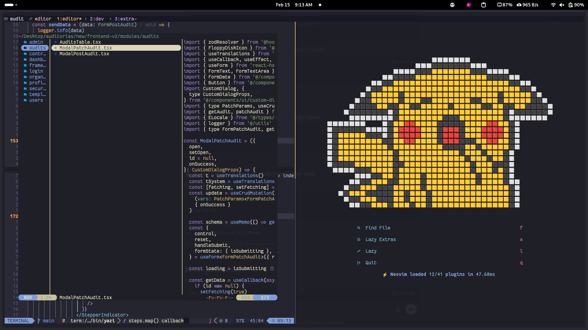

<h1 style="text-align: center;">🤠 My personal dotfiles customization</h1>
<p align="center">
  
  
  
</p>



---

## 💽 Pre install

Install the following tools for the dotfiles to work properly.

- [stow](www.gnu.org/software/stow/) Symlink dotfiles manager.
- [fish](https://software.opensuse.org/download.html?project=shells%3Afish%3Arelease%3A4&package=fish) CLI shell for linux.
- [starship](starship.rs/) Prompt customizer.
- [kitty](https://sw.kovidgoyal.net/kitty/binary/) GPU based terminal emulator.
- [cargo](https://doc.rust-lang.org/cargo) Rust and cargo package manager.
- [nvm](https://github.com/nvm-sh/nvm) Node version manager.
- [tmux](https://github.com/tmux/tmux/wiki/Installing) Terminal multiplexer.
- [nvim](https://github.com/neovim/neovim/releases) Vim based text editor.
- [lazyvim](http://www.lazyvim.org/) Easy customizer for nvim.

## 🧑‍💻 Commands for Debian 13

I already have the commands to install each tool properly in a Debian OS.

```bash
# base installation
sudo apt update 
sudo apt install curl wget git tar gzip xz-utils build-essential cmake pkg-config ca-certificates lsb-release ripgrep fd-find fzf libevent ncurses

# Stow and Fish 
sudo apt install vim 
sudo apt install stow
sudo apt install tmux
suto apt install ./fish**.deb
curl -sS https://starship.rs/install.sh | s


# Kitty config
curl -L https://sw.kovidgoyal.net/kitty/installer.sh | sh /dev/stdin
ln -sf ~/.local/kitty.app/bin/kitty ~/.local/kitty.app/bin/kitten ~/.local/bin/
cp ~/.local/kitty.app/share/applications/kitty.desktop ~/.local/share/applications/
sed -i "s|Icon=kitty|Icon=$(readlink -f ~)/.local/kitty.app/share/icons/hicolor/256x256/apps/kitty.png|g" ~/.local/share/applications/kitty*.desktop
sed -i "s|Exec=kitty|Exec=$(readlink -f ~)/.local/kitty.app/bin/kitty|g" ~/.local/share/applications/kitty*.desktop
echo 'kitty.desktop' > ~/.config/xdg-terminals.list

# Cargo
curl https://sh.rustup.rs -sSf | sh

# NVM (Shell integration already handled by fish plugin)
curl -o- https://raw.githubusercontent.com/nvm-sh/nvm/v0.40.4/install.sh | bash

# tmuxifier (requires tmux to be installed)
git clone https://github.com/jimeh/tmuxifier.git ~/.tmuxifier
rm -rf ~/.tmuxifier/.git

# nvim once is downloaded de latest version 
sudo rm -rf /opt/nvim-***-x86_64
sudo tar -C /opt -xzf nvim-linux-x86_64.tar.gz
# path already handled by fish recommended folder name "/opt/nvim"
```
