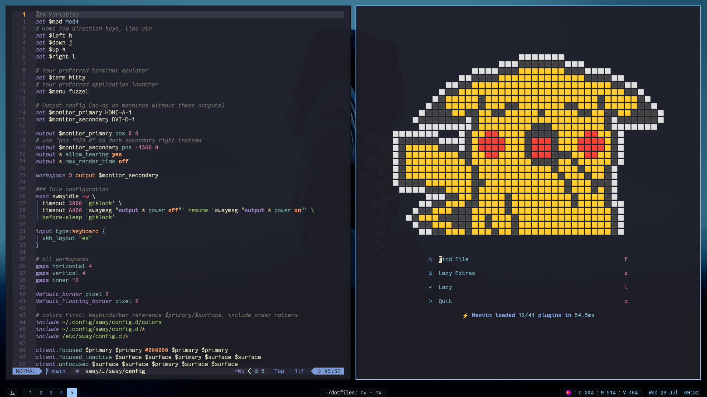
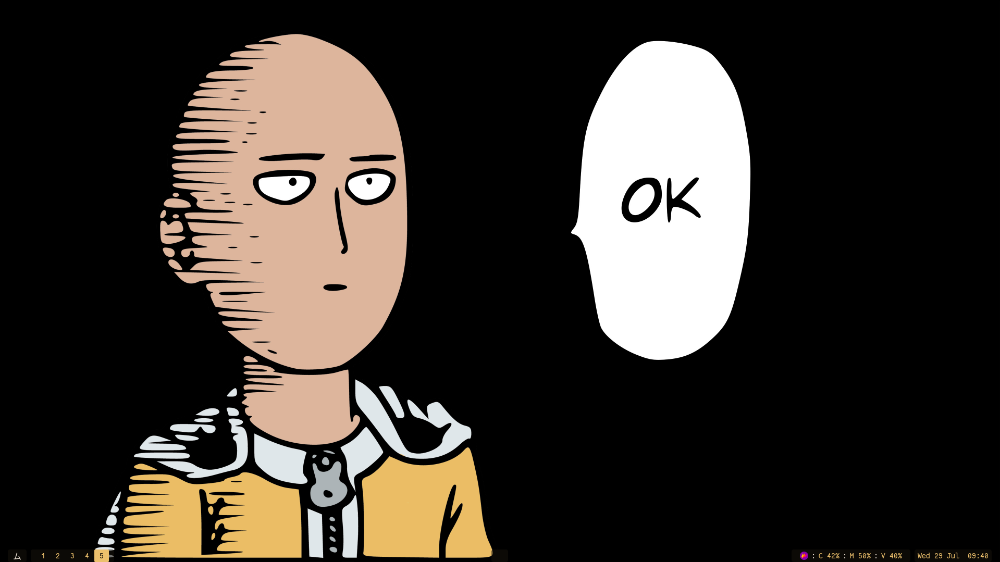

<h1 style="text-align: center;">🤠 My personal dotfiles customization</h1>
<p align="center">
  
  
</p>




---

## 📦 Estructura

Cada carpeta es un paquete de [stow](https://www.gnu.org/software/stow/): la ruta de adentro es la misma que va a tener en `$HOME`. Así puedo instalar o actualizar uno sin tocar los demás.

```
dotfiles/
├── fish/        -> ~/.config/fish
├── nvim/        -> ~/.config/nvim
├── kitty/       -> ~/.config/kitty
├── alacritty/   -> ~/.config/alacritty
├── starship/    -> ~/.config/starship.toml
├── sway/        -> ~/.config/sway
├── waybar/      -> ~/.config/waybar
├── mako/        -> ~/.config/mako
├── tickerbar/   -> ~/.config/tickerbar
├── fuzzel/      -> ~/.config/fuzzel
├── wlogout/     -> ~/.config/wlogout
├── matugen/     -> ~/.config/matugen
├── gtklock/     -> ~/.config/gtklock
├── tmux/        -> ~/.tmux, ~/.tmux.conf
├── ideavim/     -> ~/.ideavimrc
├── environment/ -> ~/.config/environment.d
└── scripts/     -> ~/docker-ps-visual.sh, ~/.local/bin/set-wallpaper
```

`wallpapers/` vive en la raíz del repo (como `assets/`), fuera de cualquier
paquete — `sway/.config/sway/config` lo referencia directo por su ruta
dentro del clon (`~/dotfiles/wallpapers/...`), no vía stow.

`install/` tampoco es un paquete de stow: son scripts de bootstrap que se
corren una sola vez (ver [Instalación](#-instalación)).

## 🔧 Instalación

Único sistema soportado: Arch/CachyOS + sway (ver `HISTORY.md` para la
migración desde Debian/Ubuntu).

> **Antes de esto:** si el repo es privado y clonás por SSH, necesitás una
> key ya agregada a tu cuenta de Git *antes* del primer comando de abajo —
> no hay forma de scriptear este paso, porque el script de instalación vive
> adentro del propio repo que todavía no clonaste:
> `ssh-keygen -t ed25519 -a 100 -C "tu-email"` y sumar la key pública en
> GitHub → Settings → SSH Keys.

```bash
git clone <este-repo> ~/dotfiles

cd ~/dotfiles/install
./install-arch.sh

cd ~/dotfiles
stow -R fish nvim kitty alacritty starship tmux ideavim scripts sway waybar mako tickerbar fuzzel wlogout matugen gtklock environment
```

`install-arch.sh` instala vía pacman/cargo/curl casi todo lo de la tabla de
[Herramientas](#-herramientas) de abajo, y es idempotente (se puede
re-correr sin repetir trabajo). Lo único manual es nvim:

```bash
sudo rm -rf /opt/nvim-***-x86_64
sudo tar -C /opt -xzf nvim-linux-x86_64.tar.gz
# el PATH ya lo maneja fish, carpeta recomendada "/opt/nvim"
```

Cada paquete de stow es opcional: `stow <paquete>` instala solo ese, `stow -D <paquete>` lo desinstala (quita los symlinks, no borra el contenido del repo). **Nunca corras `stow .`** — trata todo el repo como un solo paquete y produce symlinks mal puestos (`~/fish` en vez de `~/.config/fish`, etc.).

## 🧰 Herramientas

| Herramienta | Qué hace |
|---|---|
| [nvim](https://neovim.io/) | editor — instalación manual, ver arriba |
| [LazyVim](https://www.lazyvim.org/) | config base de nvim, incluida en el repo |
| [tmux](https://github.com/tmux/tmux) | terminal multiplexer, prefix `Ctrl-a` |
| [tmux-resurrect](https://github.com/tmux-plugins/tmux-resurrect) | guarda/restaura sesiones de tmux, vendorizado en el repo |
| [fish](https://fishshell.com/) | shell interactivo |
| [fisher](https://github.com/jorgebucaran/fisher) | plugin manager de fish, instala `nvm.fish` y `sdkman-for-fish` |
| [sway](https://swaywm.org/) | compositor Wayland tiling |
| [kitty](https://sw.kovidgoyal.net/kitty/) | terminal basada en GPU |
| [alacritty](https://alacritty.org/) | terminal alternativa |
| [docker](https://www.docker.com/) + docker-compose | contenedores |
| [cargo/rustup](https://rustup.rs/) | Rust y su gestor de paquetes |
| [pyenv](https://github.com/pyenv/pyenv) | Python version manager |
| [nvm](https://github.com/nvm-sh/nvm) | Node version manager, plugin `nvm.fish` |
| [SDKMAN!](https://sdkman.io/) | version manager de JVM/Java/Kotlin/etc |
| [.NET SDK](https://dotnet.microsoft.com/) | usado vía `$DOTNET_ROOT` |
| [Go](https://go.dev/) | `$GOPATH/bin` se agrega al PATH en `config.fish` |
| [bun](https://bun.sh/) | runtime/paquetería JS, usado vía `$BUN_INSTALL` |
| [dbeaver](https://dbeaver.io/) | cliente SQL universal |
| [Claude Code](https://claude.com/claude-code) | CLI de IA |
| [claudebar](https://github.com/mryll/claudebar) | uso del plan de Claude (sesión/semanal/extra) en waybar, reemplaza `sway/window` — se instala from-source (`make install PREFIX=~/.local`), no pacman ni AUR. Requiere `claude` logueado (`~/.claude/.credentials.json`); sin login muestra un ícono de error, no rompe waybar |
| [tickerbar](https://github.com/mryll/tickerbar) | precios de cripto/dólar (BTC, ETH, Dólar Blue vía `dolarapi`) en waybar, junto a claudebar en `group/personal` — Rust, from-source (`make install PREFIX=~/.local`), sin API key. Símbolos configurables en `tickerbar/.config/tickerbar/config.toml` |
| [yazi](https://github.com/sxyazi/yazi) | file manager TUI, integrado en nvim vía `yazi.nvim` |
| [starship](https://starship.rs/) | prompt |
| [zoxide](https://github.com/ajeetdsouza/zoxide) | `cd` inteligente, aprende directorios frecuentes |
| [eza](https://github.com/eza-community/eza) | reemplazo de `ls` (alias `lf`/`la`/`ll`/`qw`) — se instala con `cargo install`, no pacman |
| [ripgrep](https://github.com/BurntSushi/ripgrep) (`rg`) | grep rápido |
| [fd](https://github.com/sharkdp/fd) | find rápido |
| [fzf](https://github.com/junegunn/fzf) | fuzzy finder, usado en popups de tmux y en yazi |
| [waybar](https://github.com/Alexays/Waybar) | barra de estado de sway |
| [mako](https://mako-project.org) | daemon de notificaciones — corre como `systemctl --user` unit (no `exec` en sway), colores generados por matugen (`mako/.config/mako/colors`), toggle de Do Not Disturb en waybar (`custom/notifications`) |
| [fuzzel](https://codeberg.org/dnkl/fuzzel) | lanzador de aplicaciones |
| [wmenu](https://codeberg.org/adnano/wmenu) | lanzador alternativo (backup de fuzzel) |
| [matugen](https://github.com/InioX/matugen) | genera la paleta Material-You desde el wallpaper actual (`$mod+Shift+w`) |
| [gtklock](https://github.com/jovanlanik/gtklock) | pantalla de bloqueo |
| [wlogout](https://github.com/ArtsyMacaw/wlogout) | menú de sesión (`$mod+Shift+e`) |
| [flameshot](https://flameshot.org/) | capturas de pantalla con anotaciones |
| [pavucontrol](https://freedesktop.org/software/pulseaudio/pavucontrol/) | mixer de audio gráfico |
| [FantasqueSansM Nerd Font](https://www.nerdfonts.com/) | fuente usada en kitty, alacritty, waybar y fuzzel |
| [Symbols Nerd Font Mono](https://github.com/ryanoasis/nerd-fonts) (`ttf-nerd-fonts-symbols-mono`) | fallback de íconos en waybar (set moderno de Material Design Icons, ~7000 glyphs) — sin este paquete, `custom/notifications` (la campana) se renderiza vacío |
| swayidle, swaybg, grim, playerctl, pamixer, brightnessctl | utilidades que sway invoca desde sus keybinds: idle-lock, fondo de pantalla, capturas, media, volumen, brillo |
| [stow](https://www.gnu.org/software/stow/) | symlink manager, instala/desinstala cada paquete de este repo por separado |

## 🧭 Uso

- Atajos de teclado y alias: [./SHORTCUTS.md](SHORTCUTS).
- Para importar los comandos de git usados por mi [./GIT-ALIAS.md](GIT-ALIAS).
