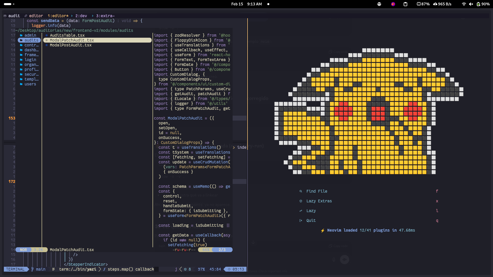

<h1 style="text-align: center;">🤠 My personal dotfiles customization</h1>
<p align="center">
  
  
</p>



---

## 📦 Estructura

Cada carpeta es un paquete de [stow](https://www.gnu.org/software/stow/): la ruta de adentro es la misma que va a tener en `$HOME`. Así puedo instalar o actualizar uno sin tocar los demás.

```
dotfiles/
├── fish/        -> ~/.config/fish
├── nvim/        -> ~/.config/nvim
├── kitty/       -> ~/.config/kitty
├── alacritty/   -> ~/.config/alacritty
├── starship/    -> ~/.config/starship.toml
├── sway/        -> ~/.config/sway
├── waybar/      -> ~/.config/waybar
├── fuzzel/      -> ~/.config/fuzzel
├── tmux/        -> ~/.tmux, ~/.tmux.conf
├── ideavim/     -> ~/.ideavimrc
├── environment/ -> ~/.config/environment.d
└── scripts/     -> ~/docker-ps-visual.sh, ~/toggle-kitty
```

`wallpapers/` vive en la raíz del repo (como `assets/`), fuera de cualquier
paquete — `sway/.config/sway/config` lo referencia directo por su ruta
dentro del clon (`~/dotfiles/wallpapers/...`), no vía stow.

Para instalar o actualizar todo de una:

```bash
cd ~/dotfiles
stow -R fish nvim kitty alacritty starship tmux ideavim scripts sway waybar fuzzel environment
```

`install/` no es un paquete de stow: son scripts de bootstrap que se corren
una sola vez (ver más abajo, sección Arch/CachyOS).

## 💽 Pre install

Instala las siguientes herramientas para que los dotfiles funcionen correctamente.

- [stow](https://www.gnu.org/software/stow/) Symlink dotfiles manager.
- [fish](https://software.opensuse.org/download.html?project=shells%3Afish%3Arelease%3A4&package=fish) CLI shell para linux.
- [starship](https://starship.rs/) Prompt customizer.
- [zoxide](https://github.com/ajeetdsouza/zoxide) `cd` inteligente, usado en `config.fish`.
- [fisher](https://github.com/jorgebucaran/fisher) Plugin manager de fish. Instala también el plugin `jorgebucaran/nvm.fish` (ver `fish/.config/fish/fish_plugins`).
- [eza](https://github.com/eza-community/eza) Reemplazo de `ls` usado en los alias `lf`/`la`/`ll`/`qw`. **Instálalo con `cargo install eza`**, no con pacman.
- [ripgrep](https://github.com/BurntSushi/ripgrep) (`rg`) y [fd](https://github.com/sharkdp/fd) (en Arch el binario ya se llama `fd`, sin alias).
- [kitty](https://sw.kovidgoyal.net/kitty/binary/) Terminal emulator basado en GPU.
- [sway](https://swaywm.org/) Compositor Wayland (tiling), config en `sway/`.
- [waybar](https://github.com/Alexays/Waybar) Barra de estado para sway, config en `waybar/`. Para los binds del `sway/config` hace falta `swayidle`, `swaylock`, `brightnessctl`.
- [FantasqueSansM Nerd Font](https://www.nerdfonts.com/) (`ttf-fantasque-nerd` en Arch) Fuente usada de forma consistente en kitty, alacritty, waybar y fuzzel.
- [fuzzel](https://codeberg.org/dnkl/fuzzel) Lanzador de aplicaciones para Wayland/sway, config con tema kanagawabones en `fuzzel/`.
- [dbeaver](https://dbeaver.io/) Cliente SQL universal.
- [docker](https://www.docker.com/) + `docker-compose`. El script habilita `docker.service` y añade el usuario al grupo `docker`.
- [alacritty](https://alacritty.org/) Terminal emulator alternativo, config en `alacritty/`.
- [cargo](https://doc.rust-lang.org/cargo) Rust y su gestor de paquetes.
- [bun](https://bun.sh/) Runtime/paquetería de JS, usado vía `$BUN_INSTALL`.
- [nvm](https://github.com/nvm-sh/nvm) Node version manager (integrado como plugin de fish).
- [pyenv](https://github.com/pyenv/pyenv) Python version manager, inicializado en `config.fish`.
- [SDKMAN!](https://sdkman.io/) Version manager de JVM/Java/Kotlin/etc (integrado como plugin de fish, `reitzig/sdkman-for-fish`).
- [.NET SDK](https://dotnet.microsoft.com/) usado vía `$DOTNET_ROOT`.
- [tmux](https://github.com/tmux/tmux/wiki/Installing) Terminal multiplexer.
- [tmux-resurrect](https://github.com/tmux-plugins/tmux-resurrect) Guarda y restaura sesiones de tmux (ver sección de abajo).
- [nvim](https://github.com/neovim/neovim/releases) Editor de texto basado en Vim.
- [lazyvim](https://www.lazyvim.org/) Customizador para nvim.

## 🖥️ Sesiones dinámicas (resurrect con nombre)

Sin tmuxifier, sin auto-guardado. Armas la sesión a mano (paneles, ventanas, programas corriendo) y cuando te gusta cómo quedó, la guardas con nombre. Los snapshots viven en `~/.tmux/resurrect/named/*.txt` (local, no se commitean).

| Acción | Atajo |
|---|---|
| Guardar sesión actual con nombre | `prefix S` (pide el nombre) |
| Cargar un layout guardado | `prefix L` (popup con fzf para elegir) |
| Guardar el último snapshot (sin nombre) | `prefix Ctrl-s` |
| Restaurar el último snapshot (sin nombre) | `prefix Ctrl-r` |

Flujo típico:
```
1. Abre tmux, arma paneles/ventanas/programas como quieras.
2. prefix S -> escribe un nombre, ej. "backend".
3. La próxima vez: abre tmux, prefix L, elige "backend".
```

## ⌨️ tmux — chuleta rápida

Prefix = `Ctrl-a`

| Acción | Atajo |
|---|---|
| Split horizontal | `prefix s` |
| Split vertical | `prefix x` |
| Moverse entre paneles | `prefix h/j/k/l` |
| Recargar config | `prefix r` |
| Buscador de sesiones (fzf) | `prefix Ctrl-j` |
| Nueva sesión con nombre | `prefix Ctrl-n` |

## 🔧 Instalación

```bash
git clone <este-repo> ~/dotfiles
cd ~/dotfiles
stow fish nvim kitty alacritty starship tmux ideavim scripts sway waybar fuzzel
```

Cada nombre es opcional: puedes correr `stow <paquete>` solo para lo que quieras instalar, o `stow -D <paquete>` para desinstalarlo (quita los symlinks sin borrar el contenido del repo).

## 🏔️ Comandos para Arch/CachyOS

Único sistema soportado a partir de ahora (soporte para Debian/Ubuntu/Mint
deprecado, ver `HISTORY.md`). Todo lo de abajo, menos nvim, está automatizado
en `install/install-arch.sh`:

```bash
cd ~/dotfiles/install
./install-arch.sh
```

El script instala vía `pacman` fish, starship, zoxide, ripgrep, fd, tmux,
stow, `base-devel` (necesario para que `cargo install eza` pueda linkear),
`zip`/`unzip` (los pide el instalador de SDKMAN),
sway/waybar/wmenu/swaybg/swayidle/swaylock/brightnessctl/grim/playerctl,
flameshot, fuzzel, dbeaver, docker + docker-compose, yazi y sus dependencias,
las libs de compilación que pyenv necesita para poder construir un Python
(`openssl zlib xz bzip2 readline sqlite tk libffi`), y la fuente
`ttf-fantasque-nerd` (`FantasqueSansM Nerd Font`, la misma que usan kitty,
alacritty y fuzzel); y vía curl rustup (para `cargo install eza`), pyenv,
kitty, SDKMAN (core, antes del plugin de fish), fisher + plugins de fish, y
Claude Code. Para docker, además habilita y arranca `docker.service` y añade
el usuario al grupo `docker` (todos estos pasos son idempotentes, no se
repiten si ya están hechos).

```bash
# nvim: paso manual, no lo automatiza install-arch.sh
sudo rm -rf /opt/nvim-***-x86_64
sudo tar -C /opt -xzf nvim-linux-x86_64.tar.gz
# el PATH ya lo maneja fish, carpeta recomendada "/opt/nvim"
```

Ver `../HISTORY.md` para el detalle de por qué cada pieza está ahí.
