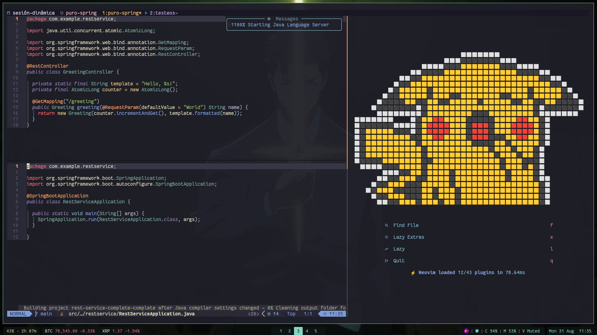

<h1 style="text-align: center;">🤠 My personal dotfiles customization</h1>
<p align="center">
  
  
</p>




---

## 📦 Estructura

Cada carpeta es un paquete de [stow](https://www.gnu.org/software/stow/): la ruta de adentro es la misma que va a tener en `$HOME`. Así puedo instalar o actualizar uno sin tocar los demás.

```
dotfiles/
├── fish/        -> ~/.config/fish
├── nvim/        -> ~/.config/nvim
├── kitty/       -> ~/.config/kitty
├── alacritty/   -> ~/.config/alacritty
├── starship/    -> ~/.config/starship.toml
├── sway/        -> ~/.config/sway
├── waybar/      -> ~/.config/waybar
├── mako/        -> ~/.config/mako
├── fuzzel/      -> ~/.config/fuzzel
├── wlogout/     -> ~/.config/wlogout
├── matugen/     -> ~/.config/matugen
├── gtklock/     -> ~/.config/gtklock
├── tmux/        -> ~/.tmux, ~/.tmux.conf
├── ideavim/     -> ~/.ideavimrc
├── environment/ -> ~/.config/environment.d
└── scripts/     -> ~/docker-ps-visual.sh, ~/.local/bin/set-wallpaper
```

`wallpapers/` e `install/` no son paquetes de stow: el primero se referencia por ruta directa, el segundo son scripts de bootstrap de una sola vez ([Instalación](#-instalación)).

## 🔧 Instalación

Arch/CachyOS + sway únicamente ([SSH keygen](https://docs.github.com/en/authentication/connecting-to-github-with-ssh) primero si clonás por SSH).

```bash
git clone git@github.com:AlexanderTemp/dotfiles.git ~/dotfiles   # SSH, con key ya agregada — para pushear cambios
# git clone https://github.com/AlexanderTemp/dotfiles.git ~/dotfiles  # HTTPS — solo lectura, sin key

cd ~/dotfiles/install
./install-arch.sh   # idempotente — instala todo salvo nvim (manual, ver abajo)

cd ~/dotfiles
stow -R fish nvim kitty alacritty starship tmux ideavim scripts sway waybar mako fuzzel wlogout matugen gtklock environment
```

```bash
# nvim: único paso manual
sudo rm -rf /opt/nvim-***-x86_64
sudo tar -C /opt -xzf nvim-linux-x86_64.tar.gz
```

`stow <paquete>` instala uno solo, `stow -D <paquete>` lo desinstala. **Nunca `stow .`** — rompe las rutas (`~/fish` en vez de `~/.config/fish`).

## 🧰 Herramientas

| Herramienta | Nota |
|---|---|
| [nvim](https://neovim.io/) | manual, ver arriba |
| [LazyVim](https://www.lazyvim.org/) | |
| [tmux](https://github.com/tmux/tmux) | prefix `Ctrl-a` |
| [tmux-resurrect](https://github.com/tmux-plugins/tmux-resurrect) | vendorizado |
| [fish](https://fishshell.com/) | |
| [fisher](https://github.com/jorgebucaran/fisher) | `nvm.fish`, `sdkman-for-fish` |
| [sway](https://swaywm.org/) | |
| [kitty](https://sw.kovidgoyal.net/kitty/) | |
| [alacritty](https://alacritty.org/) | |
| [docker](https://www.docker.com/) + compose | |
| [cargo/rustup](https://rustup.rs/) | |
| [pyenv](https://github.com/pyenv/pyenv) | |
| [nvm](https://github.com/nvm-sh/nvm) | plugin `nvm.fish` |
| [SDKMAN!](https://sdkman.io/) | |
| [.NET SDK](https://dotnet.microsoft.com/) | `$DOTNET_ROOT` |
| [Go](https://go.dev/) | |
| [bun](https://bun.sh/) | `$BUN_INSTALL` |
| [dbeaver](https://dbeaver.io/) | |
| [Claude Code](https://claude.com/claude-code) | |
| [claudebar](https://github.com/mryll/claudebar) | from-source |
| coinwatch (`waybar/scripts/coinwatch.py`) | script propio |
| [yazi](https://github.com/sxyazi/yazi) | vía `yazi.nvim` |
| [starship](https://starship.rs/) | |
| [zoxide](https://github.com/ajeetdsouza/zoxide) | |
| [eza](https://github.com/eza-community/eza) | alias `lf/la/ll/qw`, cargo |
| [ripgrep](https://github.com/BurntSushi/ripgrep) (`rg`) | |
| [fd](https://github.com/sharkdp/fd) | |
| [fzf](https://github.com/junegunn/fzf) | |
| [waybar](https://github.com/Alexays/Waybar) | |
| [mako](https://mako-project.org) | coloreado por matugen |
| [fuzzel](https://codeberg.org/dnkl/fuzzel) | |
| [wmenu](https://codeberg.org/adnano/wmenu) | backup de fuzzel |
| [matugen](https://github.com/InioX/matugen) | `$mod+Shift+w` |
| [gtklock](https://github.com/jovanlanik/gtklock) | |
| [wlogout](https://github.com/ArtsyMacaw/wlogout) | `$mod+Shift+e` |
| [flameshot](https://flameshot.org/) | |
| [pavucontrol](https://freedesktop.org/software/pulseaudio/pavucontrol/) | |
| [FantasqueSansM Nerd Font](https://www.nerdfonts.com/) | |
| [Symbols Nerd Font Mono](https://github.com/ryanoasis/nerd-fonts) | fallback waybar |
| swayidle, swaybg, grim, playerctl, pamixer, brightnessctl | keybinds de sway |
| [stow](https://www.gnu.org/software/stow/) | |

## 🧭 Uso

- Atajos de teclado y alias: [./SHORTCUTS.md](SHORTCUTS).
- Para importar los comandos de git usados por mi [./GIT-ALIAS.md](GIT-ALIAS).
